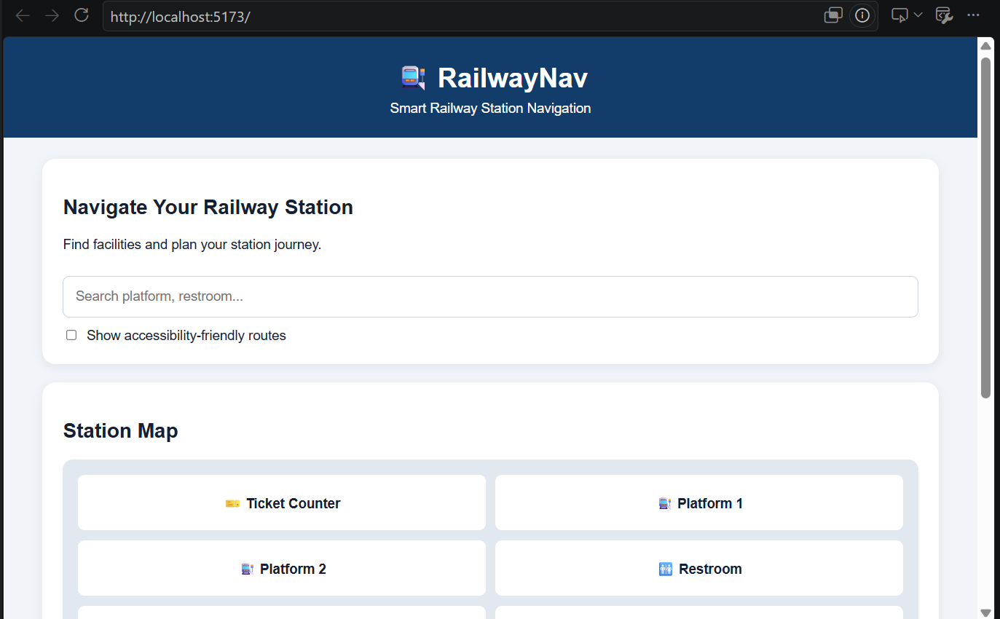
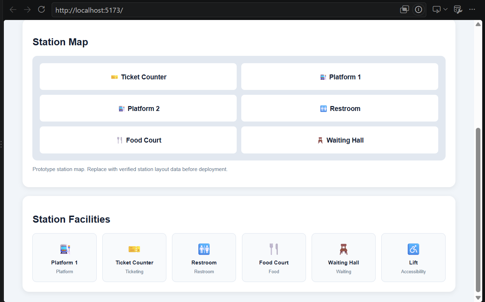

# Smart India Hackathon Workshop
# Date:17-09-2026
## Register Number:212225230293
## Name:Vemareddygari Pallavi
## Problem Title
SIH 1710: Enhancing Navigation for Railway Station Facilities and Locations
## Problem Description
Background: Railway stations are complex environments with numerous facilities and locations such as ticket counters, platforms, restrooms, food courts, and waiting areas. Passengers often face difficulties in navigating these spaces, especially in large or unfamiliar stations. Efficient and user-friendly navigation systems are crucial for improving passenger experience, reducing congestion, and ensuring timely travel connections. Description: The problem involves developing a comprehensive navigation solution for railway stations that assists passengers in locating various facilities and destinations within the station premises. This includes creating detailed maps, providing real-time directions, and integrating features such as accessibility options for individuals with disabilities. The solution should be intuitive, easy to use, and accessible via multiple platforms, including mobile devices and digital kiosks. Key challenges include updating navigation information in real-time, ensuring accuracy, and accommodating the diverse needs of all passengers. Expected Solution: The expected solution is a multi-platform navigation system that provides detailed, real-time directions to all facilities and locations within a railway station. This system should include: A mobile application with 3D interactive maps and step-by-step navigation. Digital kiosks located throughout the station with touch-screen interfaces. Voice-guided navigation for visually impaired passengers. Regular updates to reflect changes in station layout and facility locations. Integration with existing railway apps and services for seamless user experience. The solution should enhance the overall passenger experience by reducing confusion, saving time, and improving accessibility within the station.

## Problem Creater's Organization
Ministry of Railway

## Idea
```
## Idea

RailwayNav is a smart, user-friendly railway station indoor navigation system designed to help passengers find facilities and destinations quickly and easily.

The system provides an interactive station map, facility search, destination selection, step-by-step route instructions, accessibility support, and voice guidance.

### Key Features

* Interactive railway station map.
* Search for platforms, ticket counters, restrooms, food courts, and waiting areas.
* Step-by-step navigation instructions.
* Accessibility-friendly facility filtering.
* Voice guidance using browser speech synthesis.
* Digital kiosk interface for passengers.
* Responsive design for mobile and desktop devices.

The main goal is to reduce passenger confusion, improve accessibility, and make navigation inside railway stations easier.

```

## Proposed Solution / Architecture Diagram



## Use Cases
```
## Use Cases

### 1. Passenger

* Search for railway station facilities.
* View the interactive station map.
* Select a destination.
* Read step-by-step route instructions.

### 2. Visually Impaired Passenger

* Use voice guidance to hear navigation instructions.
* Access compatible audio-based guidance features.

### 3. Wheelchair User

* Filter accessible facilities.
* Identify lifts and accessibility-related facilities.
* Use verified accessible route information when available.

### 4. Station Administrator

* Manage station facility information.
* Update facility locations and accessibility details.
* Maintain accurate station data.

### 5. Digital Kiosk User

* Search for facilities using a touchscreen interface.
* View station maps and destination information.
* Access simplified navigation instructions.

```

## Technology Stack
```
## Technology Stack

| Technology     | Purpose                               |
| -------------- | ------------------------------------- |
| React.js       | Building the user interface           |
| JavaScript     | Application logic and interactions    |
| Vite           | Development server and build tool     |
| HTML5          | Application structure                 |
| CSS3           | Styling and responsive design         |
| SVG            | Interactive station map visualization |
| Web Speech API | Browser-based voice guidance          |
| Git            | Version control                       |
| GitHub         | Source code hosting                   |

### Future Technologies

* Graph-based shortest path algorithms.
* Firebase or PostgreSQL for station data management.
* QR-based indoor positioning.
* Multi-language support.
* Admin dashboard.
* Verified real-time railway station data integration.

```

## Dependencies
```
## Dependencies

### Software Requirements

* Node.js (LTS version recommended)
* npm (Node Package Manager)
* Visual Studio Code
* Git
* Modern web browser

### Project Dependencies

* React
* React DOM
* Vite
* @vitejs/plugin-react

### Browser Features

* JavaScript enabled.
* SVG support.
* Web Speech API support for voice guidance.

### Installation

Clone the repository and install the dependencies:

```bash
npm install
```

### Run the Project

```bash
npm run dev
```

### Build the Project

```bash
npm run build
```

### Limitations

The prototype currently uses illustrative station data. Actual indoor navigation, real-time updates, and verified accessibility routing require additional backend services and station-specific data.

```
```
## Result
RailwayNav is a smart railway station navigation system.
It helps passengers find platforms, ticket counters, restrooms, and other facilities.
It provides interactive maps, route instructions, accessibility support, and voice guidance.